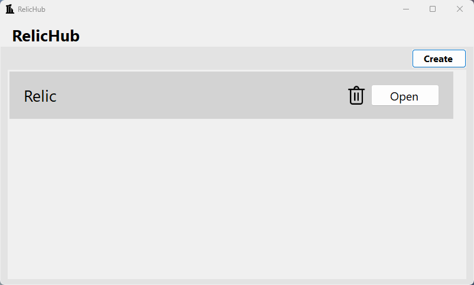
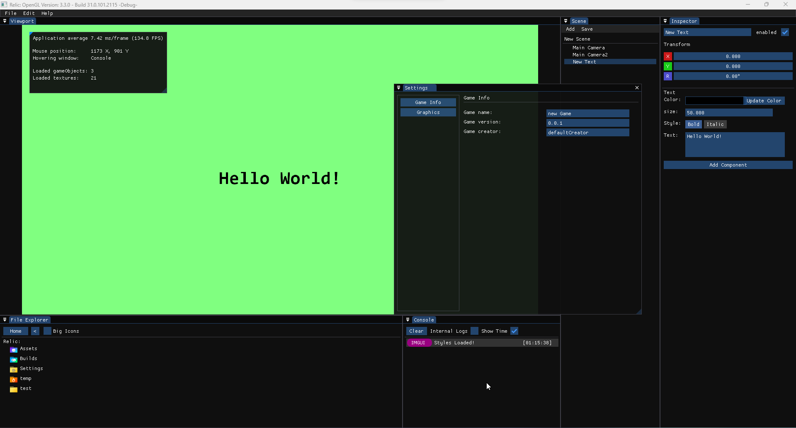
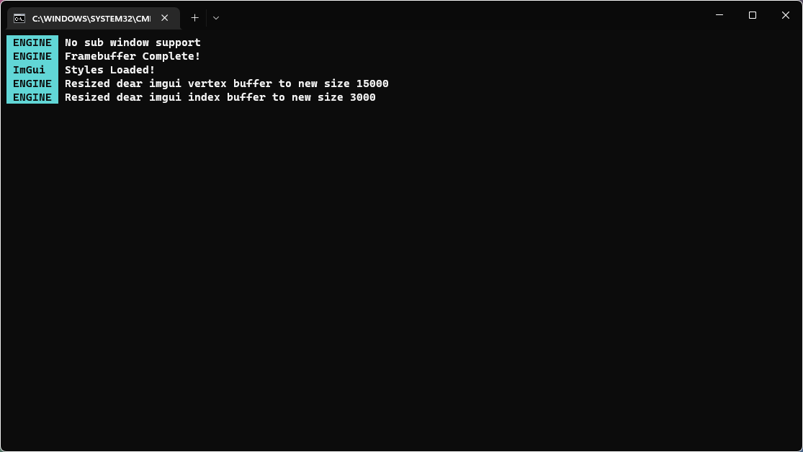

# Relic
Relic is a hobby project. An attemp to create a Game Engine using OpenTK for the game graphics and Imgui.Net for the Editor GUI enviroment.
It's scripts are heavily inspired by Unity3d and has similar methods.

### Current Features
* 2D game development environment.
* createing Gameobjects and adding Components
* It has an Engine Console and an External development Console.

### Planned Features
* Compiling usermade games.
* Creating custom scripts without recompiling the Engine.
* Creating custom editor extensions.

### Used resources
[OpenTK](https://github.com/opentk/opentk) is a fast, low-level C# wrapper for OpenGL, OpenAL & OpenCL. 
[ImGui.NET](https://github.com/mellinoe/ImGui.NET) is a .NET wrapper for the immediate mode GUI library, Dear ImGui

  

  </img> 
  "RelicHub" the place where you create, open and delete Projects.

  

  </img> 
  The main Enviroment to development games.

  

  </img> 
  This is the External Console which shows unfiltered messages by the Engine.

